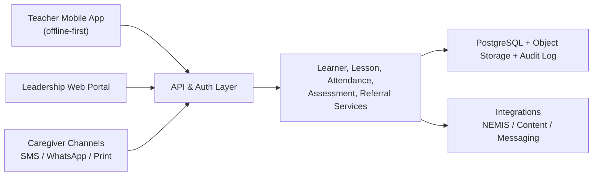

# Compassion Kenya Teacher System Design

## Working name
**Huruma TeacherHub**

`Huruma` means compassion/mercy in Swahili. The name fits a teacher system that supports whole-child development, not just classroom marks.

## 1. Executive summary
This document proposes a teacher-facing digital system for Compassion Kenya that supports teachers, church partner staff, and education coordinators serving children and youth across multiple counties. The system is designed around five realities:

1. Compassion Kenya operates at scale through local church partners and holistic child development, not a narrow school-only model.
2. Kenyan teachers are working inside the Competency-Based Education context, so the system must support outcomes, formative assessment, and learner growth rather than exam marks alone.
3. Digital access in Kenya is improving quickly, but rural and vulnerable communities still face real gaps in connectivity, devices, electricity, and digital skills.
4. Any system handling children must be safeguarding-first and compliant with Kenya's data protection rules for children's data.
5. Teachers need workflow relief, not another reporting burden.

The recommended solution is a **mobile-first, offline-capable teacher platform** with a lightweight caregiver communication layer and a web dashboard for school/church leaders and Compassion Kenya staff.

It should help teachers do six things well:

1. Plan and deliver lessons aligned to both CBC and Compassion's holistic outcomes.
2. Track attendance, participation, and academic progress.
3. Identify at-risk children early and trigger referrals.
4. Engage caregivers consistently.
5. Access teacher training and curriculum resources.
6. Produce reliable, privacy-safe reports for church partners and national teams.

## 2. Design target
The system is designed for:

1. Teachers serving Compassion-supported children in schools, child development settings, or church-led education spaces.
2. Church Development Workers and Frontline Church Partner staff.
3. School heads, education coordinators, and Compassion Kenya regional/national teams.

It is **not** designed to replace Kenya's NEMIS. It should complement NEMIS and reduce duplicate entry where possible.

## 3. Research synthesis
### Compassion Kenya context
- Compassion Kenya says it has served children and youth since 1980 and is currently serving close to 140,000 children and youth across 32 counties in partnership with over 480 churches.
- Compassion Kenya's program model is church-driven, child-focused, and holistic, with outcome areas including well-being, spiritual development, youth agency, and economic self-sufficiency.
- Compassion Kenya's program cycle emphasizes local data, evidence-informed interventions, implementation, tracking, evaluation, and continuous learning.
- Compassion has highlighted child protection as a core strength and notes Keeping Children Safe Level 1 certification.
- Compassion Kenya's public stories show teacher-adjacent needs beyond academics: mental health, drug-use prevention, menstrual health, food resilience, WASH, and youth mentorship.

### Kenya education and digital context
- Kenya continues to implement Competency-Based Education and national dialogue has emphasized teacher capacity-building and stakeholder engagement.
- KICD curriculum policy and resources stress competency-based learning, digital content, diverse learning needs, and support for learners with disabilities.
- The Ministry of ICT's Digital Literacy Programme was built to integrate technology into teaching and learning, and it reports large-scale teacher training in public primary schools.
- Kenya's mobile and broadband use is growing fast, but the Communications Authority and KNBS still report a meaningful urban-rural digital divide.
- NEMIS remains the Ministry of Education's core data platform and should be treated as the national source of truth for institutional learner data.

### Privacy and safeguarding context
- Kenya's Data Protection Act 2019 requires parental or guardian consent for processing a child's personal data and requires processing to protect the child's best interests.
- ODPC's 2025 children's data guidance emphasizes age verification, verifiable guardian consent, data minimization, technical safeguards, deletion/anonymization, and DPIAs for high-risk processing.

## 4. System vision
Build a system that helps every Compassion Kenya teacher answer four questions quickly and safely:

1. Which children need my attention today?
2. What should I teach, and how do I adapt it to this learner group?
3. Which child needs a referral or follow-up beyond the classroom?
4. What evidence do I need to record once so it can serve teaching, support, and reporting?

## 5. Product principles
### 5.1 Low-friction first
If a feature adds work without saving time, it should not ship.

### 5.2 Offline by default
Core teacher workflows must work with weak or no internet and sync later.

### 5.3 Mobile first, web second
Most field use should assume Android smartphones before laptops.

### 5.4 Holistic child development
The system must support academic, socio-emotional, health, safeguarding, spiritual, and caregiver dimensions where appropriate to Compassion's model.

### 5.5 Safeguarding before convenience
Sensitive child data must be tightly permissioned and visible on a need-to-know basis only.

### 5.6 CBC aligned
Planning, assessment, and reporting should map to competencies, not just marks.

### 5.7 Inclusive and accessible
The system should support English and Kiswahili at minimum, simple icon-led navigation, accessible typography, and accommodations for disability-related workflows.

### 5.8 Interoperable, not isolated
The platform should connect to NEMIS where possible and avoid becoming a silo.

## 6. Primary users
### 6.1 Teacher
Needs:
- Daily class list
- Attendance capture
- Lesson planning
- Quick learner notes
- Simple assessment capture
- Caregiver messaging
- Referral initiation

### 6.2 Church Development Worker / FCP education lead
Needs:
- Oversight across classes or partner sites
- Follow-up on absent/at-risk children
- Referral coordination
- Program-cycle reporting
- Training compliance tracking

### 6.3 School head / center coordinator
Needs:
- Teacher activity overview
- Attendance and performance dashboards
- Staffing/training gaps
- Safeguarding escalation visibility

### 6.4 Compassion Kenya county/regional/national staff
Needs:
- Cross-partner visibility
- Program quality metrics
- Intervention trend data
- Audit logs
- Evidence for donor and program reporting

### 6.5 Caregiver
Needs:
- Short updates
- Attendance alerts
- Meeting reminders
- Homework/support prompts
- Referral follow-up instructions

## 7. Core problem statements
The current likely pain points this system should solve:

1. Teacher information is fragmented across paper registers, WhatsApp, spreadsheets, and separate reporting tools.
2. Holistic support issues such as hunger, menstrual health, mental health, and abuse risk are noticed late or not routed properly.
3. Teachers spend too much time repeating data entry for teaching, partner reporting, and follow-up.
4. Curriculum resources exist, but teachers need localized, age-appropriate, practical guidance tied to classroom reality.
5. Leadership lacks timely visibility into attendance, referrals, intervention completion, and teacher support needs.

## 8. Proposed system scope
### 8.1 Module A: Teacher home dashboard
Purpose:
Give teachers one screen for today's work.

Key features:
- Today's classes or groups
- Attendance shortcuts
- Learners needing follow-up
- Upcoming assessments
- Caregiver communication queue
- Pending referrals
- Offline sync status

### 8.2 Module B: Learner profile and support card
Purpose:
Create a single, role-based view of each learner.

Fields:
- Basic identity and class/group
- Guardian contacts
- NEMIS or local learner ID
- Attendance trend
- Competency progress
- Support needs and accommodations
- Referral history
- Interests, talents, goals

Rules:
- Sponsorship-sensitive fields should be hidden from most teachers unless operationally required.
- Safeguarding notes should be visible only to cleared roles.

### 8.3 Module C: Lesson planner and curriculum support
Purpose:
Help teachers plan quickly using both Kenyan and Compassion frameworks.

Capabilities:
- Select grade/age band
- Map lesson to CBC strand/outcome
- Map lesson to Compassion outcomes:
  - Well-being
  - Spiritual development
  - Youth agency
  - Economic self-sufficiency
- Pull from approved resource libraries, including Compassion curriculum resources and locally approved content
- Suggest adaptations for:
  - low-resource classrooms
  - mixed-ability learners
  - disability inclusion
  - low-connectivity/offline teaching
- Attach printable or SMS-shareable activities

### 8.4 Module D: Attendance, engagement, and early-warning
Purpose:
Catch problems early.

Capture:
- School attendance
- Center/program attendance
- Late arrival
- Reason for absence
- Participation level

Automatic flags:
- 3 consecutive absences
- repeated menstrual-related absence
- sudden performance drop
- repeated hunger/fatigue notes
- behavior change
- missed caregiver meetings

Output:
- Follow-up task
- caregiver message
- referral suggestion
- supervisor notification for severe cases

### 8.5 Module E: CBC-aligned assessment and learner portfolio
Purpose:
Support competency tracking without turning the system into a pure exam tool.

Features:
- Quick formative assessment entry
- Competency rubrics
- Project and performance evidence
- Photo/audio evidence for offline upload
- End-term learner narrative summary
- Class heat map by competency

### 8.6 Module F: Referral and case management
Purpose:
Bridge teaching and whole-child support safely.

Referral categories:
- Child safeguarding/protection
- Mental health and psychosocial support
- Menstrual health/WASH
- Nutrition/food insecurity
- Medical support
- Disability assessment/support
- Fee/material support
- Substance use risk
- Home visit follow-up

Workflow:
1. Teacher logs concern.
2. System assigns urgency.
3. Referral routes to approved staff.
4. Action plan and status are tracked.
5. Closure is documented with audit trail.

Important:
This module must support strict permissioning and legal/safeguarding review.

### 8.7 Module G: Caregiver engagement
Purpose:
Keep families in the loop with simple communication.

Channels:
- SMS
- WhatsApp
- printed take-home slips where digital channels fail

Use cases:
- absence alerts
- caregiver meeting reminders
- homework/help prompts
- positive encouragement messages
- referral follow-up

### 8.8 Module H: Teacher development and coaching
Purpose:
Build teacher capacity, not only teacher reporting.

Features:
- micro-courses
- short videos and offline guides
- peer discussion groups
- coaching observations
- certification progress
- event and training attendance

This fits Kenya's push for teacher capacity-building and Compassion Kenya's existing training-oriented partnerships.

### 8.9 Module I: Leadership analytics
Purpose:
Provide visibility at FCP, county, and national level.

Dashboards:
- attendance trend
- active referrals by type
- safeguarding incident handling SLA
- teacher usage and training completion
- learner support trends by county
- girls' attendance and menstrual-health-related absenteeism
- transition and progression indicators

## 9. Best-fit operating model
The best model is a **hub-and-spoke structure**:

1. Each teacher works primarily in the mobile app.
2. Each FCP or school lead manages supervision in a web dashboard.
3. Compassion Kenya staff monitor quality and trends across partners.
4. Caregivers receive communication through low-friction channels.

This keeps classroom workflows light while still giving leadership usable oversight.

## 10. Recommended workflows
### 10.1 Daily teacher workflow
1. Open dashboard.
2. Mark attendance in under 3 minutes.
3. Review flagged learners.
4. Deliver lesson with saved plan/resources.
5. Record quick assessment evidence.
6. Trigger follow-up or referral if needed.

### 10.2 Weekly planning workflow
1. Choose class/group.
2. Select CBC outcomes for the week.
3. Add Compassion holistic outcomes.
4. Pull lesson ideas/resources.
5. Generate printable or offline activity pack.
6. Share caregiver prompts where needed.

### 10.3 At-risk learner workflow
1. Attendance or assessment trend triggers alert.
2. Teacher records context note.
3. Caregiver is contacted.
4. If issue persists, referral is escalated.
5. Assigned staff documents intervention.
6. Case is reviewed and closed.

### 10.4 Program cycle workflow
1. Local partner reviews learner and community data.
2. Priority issues are selected.
3. Intervention plans are assigned.
4. Teachers and staff capture implementation evidence.
5. Outcomes are reviewed and adjusted.

This directly mirrors Compassion Kenya's published program-cycle logic.

## 11. Data model overview
Core entities:

1. User
2. Role
3. Organization
4. Church partner / school / center
5. Teacher
6. Learner
7. Guardian
8. Class or group
9. Attendance record
10. Lesson plan
11. Competency record
12. Assessment artifact
13. Referral case
14. Safeguarding incident
15. Communication log
16. Training module
17. Audit log

Key design rule:
Separate **general learner data** from **highly sensitive case data** so access can be segmented.

## 12. Technical architecture

### 12.1 Frontend
- **Teacher app**: Android-first mobile application or installable PWA with offline storage
- **Leadership portal**: responsive web app
- **Caregiver layer**: SMS/WhatsApp integration

### 12.2 Backend
- API gateway
- authentication and role service
- learner/profile service
- curriculum and lesson service
- attendance and assessment service
- referral/case management service
- messaging service
- analytics/reporting service
- integration service

### 12.3 Storage
- PostgreSQL for core transactional data
- object storage for files and media
- local SQLite or IndexedDB on device for offline-first sync
- append-only audit/event log for sensitive actions

### 12.4 Suggested stack
If building from scratch with maintainability in mind:

- Mobile: Flutter
- Web portal: Next.js
- Backend: NestJS or Django
- Database: PostgreSQL
- Queue/jobs: Redis + worker
- BI/reporting: Metabase or Power BI
- Messaging: SMS gateway + WhatsApp Business integration

Why this stack:
- strong mobile support
- good offline patterns
- moderate hiring availability
- manageable total cost of ownership

## 13. Offline and sync design
Because rural connectivity is uneven, the system should assume delayed sync.

Offline-capable features:
- attendance
- basic learner lookup
- lesson plans
- assessment capture
- local notes
- queued SMS/WhatsApp drafts

Sync rules:
- teacher device stores local encrypted queue
- conflict resolution favors timestamp plus supervisor review for sensitive records
- safeguarding cases should sync with highest priority
- large media should compress before upload

## 14. Integration strategy
### Must-have
1. **NEMIS**
   - import school and learner identifiers where allowed
   - avoid duplicate school registry maintenance

2. **SMS gateway**
   - absence alerts
   - meeting reminders
   - caregiver nudges

3. **WhatsApp**
   - richer caregiver communication where appropriate

### Should-have
1. **Compassion content repositories / ForChildren resources**
   - approved lesson and training materials

2. **Mwalimu PLUS or similar teacher support platforms**
   - only if the partnership is still active and technical/legal alignment is feasible

### Optional
1. BI tools
2. HR/training systems
3. Payment rails such as M-Pesa for future stipend, reimbursement, or event support workflows

## 15. AI use: recommended but tightly bounded
AI can help, but it should not make child-risk decisions autonomously.

Safe AI use cases:
- draft lesson plans from approved content
- translate content between English and Kiswahili
- summarize teacher notes into reports
- suggest caregiver-friendly message wording
- recommend low-resource activity ideas

High-risk uses to avoid or tightly restrict:
- autonomous safeguarding decisions
- automated eligibility decisions for support
- opaque risk scoring without human review
- generation of unreviewed child case narratives for external use

Rule:
**AI assists teachers; humans make decisions.**

## 16. Safeguarding, privacy, and compliance design
### 16.1 Consent and lawful basis
- capture guardian consent for child data processing
- record who consented, when, and for what purpose
- support consent withdrawal workflows

### 16.2 Child-data protections
- age verification or guardian relationship verification
- data minimization by form and role
- no unnecessary photo/audio capture
- retention schedules for sensitive records
- delete or anonymize records when no longer needed

### 16.3 Role-based access control
- teacher: only assigned learners
- FCP lead: own partner site
- county/regional lead: assigned geography
- safeguarding lead: approved case access only
- auditors/admins: tightly logged privileged access

### 16.4 Technical controls
- encryption in transit and at rest
- device PIN and session timeout
- field-level encryption for case data
- tamper-evident audit logs
- breach response workflow

### 16.5 Governance controls
- conduct a DPIA before launch
- register as required with ODPC
- define incident reporting SOPs
- train staff on child-data handling

## 17. Inclusion design
The system should deliberately support:

1. learners with disabilities
2. low-literacy caregivers
3. rural teachers with basic devices
4. girls at risk of menstrual-health-related absenteeism
5. children affected by hunger, mental health strain, or protection concerns

Specific design choices:
- icon-assisted forms
- simple language mode
- voice note support for internal staff use
- disability accommodation fields
- printable alternatives where phones fail
- accessible contrast and text sizing

## 18. MVP recommendation
Do not build everything at once.

### MVP should include
1. user and role management
2. teacher dashboard
3. learner profiles
4. attendance and early warning
5. lesson planner with approved resource links
6. caregiver SMS messaging
7. basic referral workflows
8. leadership dashboard
9. offline sync for core teacher actions

### Exclude from MVP
1. advanced AI
2. complex sponsor communications
3. full payroll or finance workflows
4. nationwide deep integrations beyond one or two core systems
5. overly detailed case-management customizations

## 19. Pilot design
### Recommended pilot shape
- 8 to 12 Frontline Church Partners
- 3 counties with varied operating conditions:
  - one urban or peri-urban
  - one rural
  - one hard-to-reach or resource-constrained setting

### Pilot goals
- validate teacher adoption
- measure attendance capture quality
- validate referral workflow safety
- test offline sync under real conditions
- measure caregiver response rates

### Pilot success thresholds
- 80%+ weekly active teacher use
- 90%+ attendance capture on active classes/groups
- referral acknowledgment within defined SLA
- no major privacy or safeguarding breaches
- measurable reduction in manual duplicate reporting

## 20. Rollout roadmap
### Phase 0: Discovery and co-design (4-6 weeks)
- field interviews
- workflow mapping
- paper form audit
- safeguarding/legal review
- data dictionary

### Phase 1: MVP build (10-14 weeks)
- teacher app
- dashboard
- learner records
- attendance
- messaging
- basic referrals

### Phase 2: Pilot and hardening (8-12 weeks)
- county pilots
- offline fixes
- reporting improvements
- training and support model

### Phase 3: Scale-up (3-6 months)
- more counties and partners
- additional training modules
- NEMIS improvements
- richer analytics

### Phase 4: Optimization
- AI assist
- advanced portfolio features
- predictive planning and resource allocation

## 21. Team required
Minimum build team:

1. Product manager
2. Education domain lead
3. Safeguarding and privacy lead
4. UX researcher/designer
5. Mobile engineer
6. Backend engineer
7. Web engineer
8. QA engineer
9. Data/analytics specialist
10. Field training and change-management lead

## 22. Success metrics
### Teacher metrics
- weekly active users
- time to take attendance
- lesson plan reuse rate
- training completion rate

### Learner metrics
- attendance improvement
- reduction in chronic absenteeism
- competency progression
- referral closure rate

### Protection and support metrics
- time from alert to follow-up
- safeguarding case SLA compliance
- caregiver contact completion
- girls' attendance trend in supported sites

### Organizational metrics
- reporting turnaround time
- duplicate data entry reduction
- county-level visibility of intervention performance

## 23. Key risks and mitigations
### Risk 1: Teachers see it as extra reporting
Mitigation:
- design around the teacher day
- remove duplicate forms
- keep common tasks under 3 taps where possible

### Risk 2: Connectivity disrupts use
Mitigation:
- offline-first architecture
- local storage
- compressed sync

### Risk 3: Sensitive child data leaks
Mitigation:
- strict RBAC
- field-level protection
- audit logs
- privacy training

### Risk 4: Tool duplicates NEMIS
Mitigation:
- integrate rather than replicate
- keep this system focused on teacher workflow and whole-child support

### Risk 5: Pilot succeeds but scaling fails
Mitigation:
- choose counties with diverse conditions
- define support model early
- build simple admin and training processes

## 24. Why this system fits Compassion Kenya specifically
This design is a strong fit because it matches Compassion Kenya's published identity and operating model:

1. **Church-driven**: supports FCP-led delivery and local contextualization.
2. **Child-focused**: centers learner well-being and progression.
3. **Holistic**: includes education, protection, health, and caregiver engagement.
4. **Evidence-based**: aligns with the program cycle and intervention tracking.
5. **Scale-aware**: built for many counties and partner sites.
6. **Safeguarding-minded**: reflects both Compassion's protection posture and Kenya's child-data rules.

## 25. Recommendation
Compassion Kenya should build or commission **Huruma TeacherHub** as a **teacher workflow and whole-child support platform**, not as a generic school ERP.

The best first version is:
- mobile-first
- offline-capable
- CBC-aligned
- caregiver-connected
- referral-enabled
- safeguarding-first
- integrated with existing national education data structures where feasible

If you want the highest-return next step, it is this:

**Run a 4-6 week co-design sprint with teachers, FCP leaders, safeguarding staff, and county program teams, then build the MVP around attendance, lesson planning, early warning, caregiver messaging, and referrals.**

## 26. Source notes
Key sources used to ground this design:

1. Compassion Kenya homepage and program pages  
   https://compassionkenya.org/  
   https://compassionkenya.org/core-program/  
   https://compassionkenya.org/program-cycle/

2. Compassion Kenya brochure and publications  
   https://compassionkenya.org/wp-content/uploads/2024/06/Compassion-International-Kenya-Brochure_Online-1.pdf  
   https://compassionkenya.org/publications/

3. Compassion Kenya stories on education awards, mental health, menstrual health, and food resilience  
   https://compassionkenya.org/celebrating-the-gift-of-knowledge-education-day-awards-ceremony/  
   https://compassionkenya.org/church-led-community-initiative-on-mental-health-and-drug-use/  
   https://compassionkenya.org/empowering-girls-sustainable-menstrual-health-transformation-in-baringo-county/  
   https://compassionkenya.org/growing-health-growing-hope-inside-kenyas-food-resiliency-tripartite-project/

4. Kenya Ministry of Education pages on CBE/CBC and NEMIS  
   https://www.education.go.ke/ps-bitok-rallies-nation-embrace-competency-based-education-future-ready-generation  
   https://www.education.go.ke/quality-education-expected-after-ministry-engages-stakeholders  
   https://www.education.go.ke/nemis

5. KICD curriculum policy and CBC materials  
   https://kicd.ac.ke/sdm_categories/competency-based-curriculum-material/  
   https://kicd.ac.ke/wp-content/uploads/2017/10/national-curriculum-policy.pdf

6. Ministry of ICT / ICT Authority material on the Digital Literacy Programme  
   https://ict.go.ke/digital-literacy-programmedlp  
   https://icta.go.ke/

7. Communications Authority of Kenya digital access reports  
   https://www.ca.go.ke/index.php/mobile-broadband-use-surges-smartphone-penetration-climbs-ca-report-shows  
   https://www.ca.go.ke/urban-rural-digital-divide-hinders-ict-uptake-joint-ca-and-knbs-survey-shows

8. Kenya ODPC Data Protection Act resources and 2025 children's data guidance  
   https://www.odpc.go.ke/  
   https://www.odpc.go.ke/wp-content/uploads/2024/02/TheDataProtectionAct__No24of2019.pdf  
   https://www.odpc.go.ke/wp-content/uploads/2025/11/ODPC-%E2%80%93-Guidance-Note-for-Processing-Childrens-Data.pdf

9. UNESCO teacher digital-skills and inclusion-related materials  
   https://www.unesco.org/en/articles/unesco-trains-teachers-kenya-inspire-next-generation-scientists?hub=79845  
   https://www.unesco.org/en/inclusion-education/need-know?hub=70285

10. Related digital/offline education references used as design inspiration  
   https://compassionkenya.org/compassion-international-kenya-signs-mou-with-mwalimu-plus/  
   https://www.forchildren.com/hcd-curriculum/  
   https://worldpossiblekenya.org/
